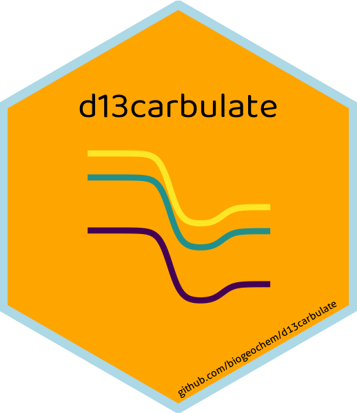

# d13carbulate 

This package calculates the δ^13^C values for all dissolved carbonate species within a water sample (CO2~(aq)~, HCO~3~^-^, and CO~3~^2-^) from pH, total DIC concentration, water temperature, and concentrations of the carbonate species. Check out the other package [`carbulate`](https://github.com/biogeochem/carbulate) to calculate concentrations for all dissolved carbonate species (from DIC, pH, and water temperature).  

## Installation

``` r
library(devtools)
devtools::install_github("biogeochem/d13carbulate")
```

## Parameters

`d13carbulate(dat, temp_col_C, d13C_DIC_col, DIC_col_mg.L, CO3_col_uM, HCO3_col_uM, CO2_col_uM)`

`dat` - Your dataframe with values  
`temp_col_C` - Name of column with your measured water temperature (in Celsius)  
`d13C_DIC_col` Name of column with your d13C of DIC (per mille PDB)  
`DIC_col_mg.L` Name of column that contains your measured dissolved inorganic carbon concentration (mg C/L)  
`CO3_col_uM` - Name of column that contains your measured/calculated carbonate concentrations (umol C/L)  
`HCO3_col_uM` - Name of column that contains your measured/calculated bicarbonate concentrations (umol C/L)  
`CO2_col_uM` - Name of column that contains your measured/calculated dissolved carbon dioxide concentrations (umol C/L)  

## Example

This is how you would input this function to add the carbonate species to the dataframe `water.dat`:

`water.dat <- d13carbulate(water.dat, 'Temp_C', 'd13C_DIC_permille', 'DIC_mgC.L', 'calc_CO3_uM', 'calc_HCO3_uM', 'calc_CO2_uM')`
