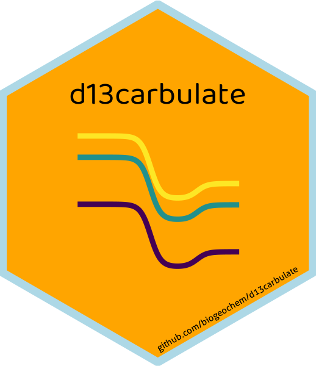

# d13carbulate 

This package calculates the δ13C values for all dissolved
carbonate species within a water sample (CO2(aq),
HCO3-, and CO32-) from pH,
total DIC concentration, water temperature, and concentrations of the
carbonate species. Check out the other package
[`carbulate`](https://github.com/paukes/carbulate) to calculate
concentrations for all dissolved carbonate species (from DIC, pH, and
water temperature).

## Parameters

d13carbulate(df, temp\_col\_C, d13C\_DIC\_col, DIC\_col\_mg.L,
CO3\_col\_uM, HCO3\_col\_uM, CO2\_col\_uM)

df - Your dataframe with values  
temp\_col\_C - Name of column with your measured water temperature (in
Celsius)  
d13C\_DIC\_col Name of column with your d13C of DIC (per mille PDB)  
DIC\_col\_mg.L Name of column that contains your measured dissolved
inorganic carbon concentration (mg C/L)  
CO3\_col\_uM - Name of column that contains your measured/calculated
carbonate concentrations (umol C/L)  
HCO3\_col\_uM - Name of column that contains your measured/calculated
bicarbonate concentrations (umol C/L)  
CO2\_col\_uM - Name of column that contains your measured/calculated
dissolved carbon dioxide concentrations (umol C/L)

## Example

This is how you would input this function to add the carbonate species
to the dataframe ‘water.df’:

water.df \<- d13carbulate(water.df, ‘Temp\_C’, ‘d13C\_DIC\_permille’,
‘DIC\_mgC.L’, ‘calc\_CO3\_uM’, ‘calc\_HCO3\_uM’, ‘calc\_CO2\_uM’)
